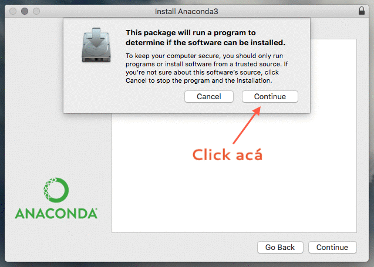
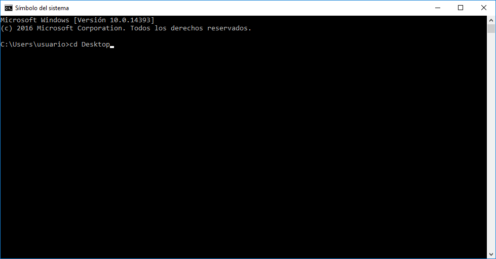
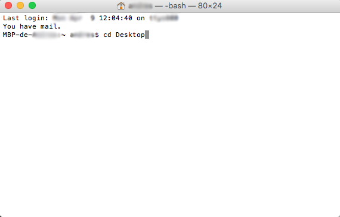
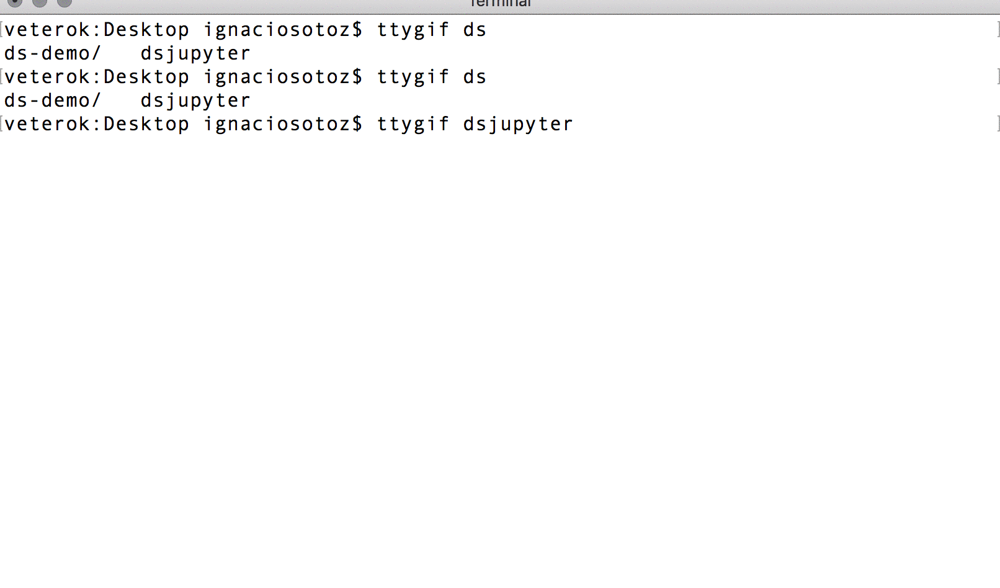

# Guía de instalación de Herramientas para Fundamentos de Data Science

> We're drowning in information and starving for knowledge. - John Naisbitt

Estamos en un momento donde todo el mundo está generando información de manera constante. Desde transacciones bancarias a encuestas de satisfacción, la omnipresencia de los datos en industrias, gobiernos y disciplinas nos obliga a aprender a manipular datos para entender el mundo. La comprensión y análisis de éstos resulta fundamental para el éxito de proyectos y nos entrega herramientas valiosas que pueden abrir oprtunidades.

Como un campo híbrido entre Ciencias de la Computación, Matemática y Estadística, y Negocios, Data Science se sirve de estos elementos para desarrollar explicaciones, identificar patrones y predecir resultados que nos ayuden a comprender el mundo y tomar mejores decisiones.

# Herramientas utilizadas en el Curso

> Para el curso necesitaremos lo siguiente:

- Python 3.6
- Jupyter Notebook
- Terminal

> La instalación de estas herramientas se realiza mediante Anaconda, que se preocupa de la instalación de todos los elementos.

### Jupyter Notebook: Python + Texto

Jupyter Notebook (antes denominado iPython Notebook) es un ambiente de trabajo que busca unificar las herramientas de documentación y ejecución de código en un mismo archivo. Los notebooks permite la lectura fácil para los humanos, así como la compartimentalización del código para la máquina.

## Pasos a seguir para Instalación

1. Descargar Anaconda con la versión 3.6 en [https://www.anaconda.com/download/](https://www.anaconda.com/download/)
2. Instalar Anaconda en tu equipo. Los pasos se encuentran detallados en el siguiente gif

3. Para generar nuestro primer notebook, abrimos el Terminal y ejecutamos `jupyter notebook`. Aquí el paso a paso: 

>__Importante:__ Si presentan dificultades en esta etapa o no logran entenderlo, lleguen un poco antes al workshop y los profesores los guiarán. No es difícil, solamente algo nuevo para algunos.

- __Para los usuarios de Windows__, como Terminal usaremos _Anaconda Prompt_. Éste se puede encontrar mediante el Menú Inicio, posteriormente escribiendo su nombre. 
	- Abrir el programa.
	- Primero escribimos y ejecutamos dentro del terminal el texto `cd Desktop`, como muestra la imagen. Con esto nos estamos moviendo al Escritorio de nuestro equipo.
	
	- Luego ejecutamos `md ds-demo`, con esto estamos creando una carpeta nueva llamada _ds-demo_. 
	- Desde el mismo programa ahora usamos `cd ds-demo`, esto para cambiarnos a la carpeta recién creada.
	- Finalmente, abrimos Jupyter ejecutando `jupyter notebook`.
- __Para los usuarios de Mac / Linux__, se puede ingresar escribiendo `Terminal` dentro de Spotlight (o Búsqueda en Linux). Para ingresar a Spotlight, presione `cmd + <Espacio>`. 
	- Abrir el programa.
	- Primero escribimos y ejecutamos dentro del terminal el texto `cd Desktop`, como muestra la imagen. Con esto nos estamos moviendo al Escritorio de nuestro equipo.
	
	- Luego ejecutamos `mkdir ds-demo`, con esto estamos creando una carpeta nueva llamada _ds-demo_.
	- Desde el mismo programa ahora usamos`cd ds-demo`, esto para cambiarnos a la carpeta recién creada.
	- Finalmente, abrimos Jupyter ejecutando `jupyter notebook`.

- Los pasos se encuentran detallados en el siguiente gif.

- Si lograron abrir el notebook sin problemas, pueden cerrarlo desde la vista de terminal presionando _ctrl+c_ en dos ocasiones. Luego cierran  Terminal y la ventana del navegador que se abrió.
- Ya tienen todo lo necesario para comenzar el taller.

4. Es necesario que lean la guía de trabajo para entender algunos conceptos previos al curso. Descargue acá la [guía de trabajo](toolkit_jupyter.md)([Versión PDF](toolkit_jupyter.pdf)).

## ¿Qué contiene este repositorio? 

* [Toolkit Jupyter](toolkit_jupyter.md): Instructivos de instalación y flujo de trabajo con Jupyter. La versión `.pdf` puede ser descargada [acá](./toolkit_jupyter.pdf)
* [toolkit_img](./toolkit_img/): Imágenes insertadas en `markdown_jupyter.md`.

